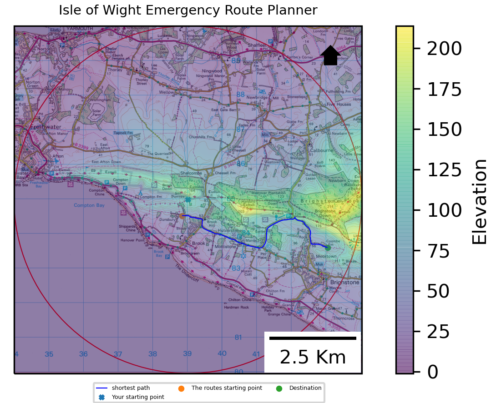
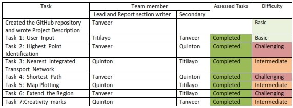
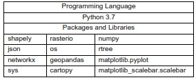

               
<h1 align="center">Flood Emergency Planning Software</h1>

|  | 
|:--:| 
| *The output plots the highest and nearest point within a 5km buffer.* |

Part of the Geospatial Programming module in my GIS and Computing  MSc (Distinction, 83%).

[Link to the Repository](https://github.com/TDAYENI/Flood-Emergency-Planning-Software.git)
<h2 align="center">Introduction</h2>

The software is designed to take a user's input as British National Grid (BNG) coordinates, find the nearest highest point within a 5km buffer then calculate and display the shortest route to the location.
The project was developed in a group with three members; Table 1 depicts how the task was divided during development, the relative task difficulty of each stage (what we struggled with) and which parts of the assessment were completed. Lead, and Secondary refers to the method used for software development, the team brainstormed individually and wrote pseudocode on Microsoft Teams collectively. The Lead would then be tasked with generating the main code and writing the relevant report section. The secondary would look over the code, improve its efficiency, provide an alternative solution. The third member or the secondary would prepare for the next stage and write their report section. Through this process, it took two weeks to design the software. The two fundamental limitations are that only BNG coordinates can be inputted; as there is no transformation mechanism. Secondly, the software can only be used for walking and not driving since a directed graph was not used in task 4. 

|  | 
|:--:| 
| *Table 1: The process of developing the software* |

<h2 align="center">Project Description</h2>

The software uses python 3.7 and a range of different python packages listed in Table 2. The software requires the material file to be in the same directory containing the elevation raster dataset, integrated transport network JSON file, a background map and a shapefile of the Isle of Wight. When the zip file is downloaded and extracted its structure must remain the same due to specific file paths hardcoded into the software.
The software is in a python file named main.py, which is the only file which needs to be open and executed. 

To execute the software without error, ensure all the packages in Table 2 are installed.
When the code is run, the user will be prompted to enter a numeric Northing and Easting BNG coordinate in the python console then the software will run and return a window with the Plot of the shortest route. 

|  | 
|:--:| 
| * Table 2: Prerequisites for the software* |

